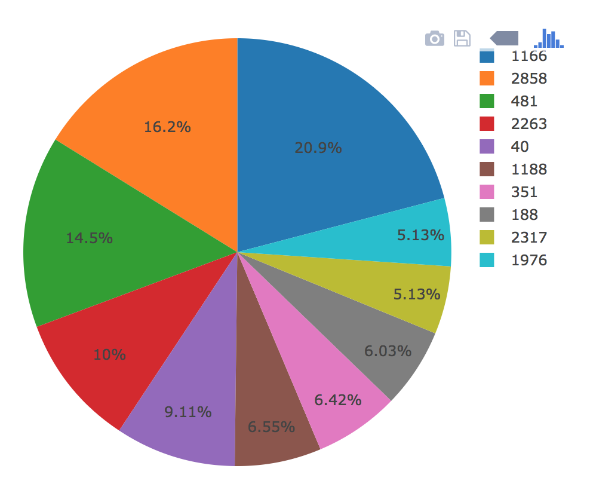

# Belly Button Biodiversity
The Belly Button Biodiversity Project began in January 2011 to investigate the microbes that inhabit human navels and the factors that promote microbiodiversity in this region. The purpose of this project to is build an interactive dashboard to explore the data collected from the Belly Button Biodiversity Project. Hundreds of volunteers participated in the study, donating samples from which they were plated on agar and later sequenced at the 16SrRNA gene which provides a molecular fingerprint to identify bacterial species. 
## Getting Started

Instructions for getting started. This dashboard uses a Flask API to serve the data needed for the visualizations. It is best to clone this repository and to run it on your local machine for development and testing purposes. 

### Prerequisites

Install the following dependencies by running the following code: ``` pip install -r requirements.txt ``` 

```
certifi==2018.4.16
click==6.7
Flask==1.0.2
Flask-SQLAlchemy==2.3.2
itsdangerous==0.24
Jinja2==2.10
MarkupSafe==1.0
numpy==1.14.5
pandas==0.23.3
python-dateutil==2.7.3
pytz==2018.5
six==1.11.0
SQLAlchemy==1.2.10
Werkzeug==0.14.1
```

### Deployment

Deploy this Flask App to Heroku by using the provided sqlite file for the database. Heroku is a free open-source platform allowing you to build, run, and operate application on the cloud. 


## Built With

* Plotly.js - The visualization framework used
* Heroku - Application hosting service
* Flask - Web framework for the local development environment
* SQLite - Relational database management system contained in a C library

## Visualizations

Uses Plotly.js to build interactive charts for dashboard.

* PIE chart that uses data from flask samples route (`/samples/<sample>`) to display the top 10 samples.

  * Uses `sample_values` as the values for the PIE chart

  * Uses `otu_ids` as the labels for the pie chart

  * Uses `otu_labels` as the hovertext for the chart

  

* Bubble Chart that uses data from flask samples route (`/samples/<sample>`) to display each sample.

  * Uses `otu_ids` for the x values

  * Uses `sample_values` for the y values

  * Uses `sample_values` for the marker size

  * Uses `otu_ids` for the marker colors

  * Uses `otu_labels` for the text values

  

* Display the sample metadata from the route `/metadata/<sample>`

  * Display each key/value pair from the metadata JSON object somewhere on the page

* Updates all of the plots any time that a new sample is selected.


### Author
* **Michael Garza**
